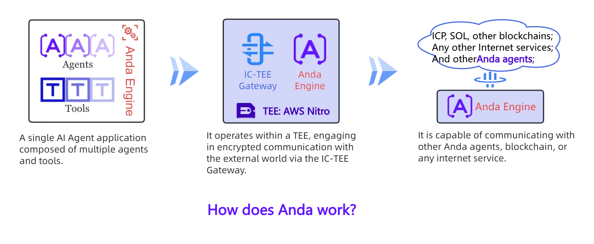

# `Anda`

> 🤖 An AI agent framework built with Rust, powered by ICP and TEEs.

## 🌍 README Translations

[English readme](./README.md) | [中文说明](./README_CN.md)

## 🤖 Introduction

Anda is an AI agent framework built with Rust, featuring ICP blockchain integration and TEE support.
It is designed to create a highly composable, autonomous, and perpetually memorizing network of AI agents.
By connecting agents across various industries, Anda aims to create a super AGI system, advancing artificial intelligence to higher levels.



### ✨ Key Features

1. **Composability**:
   Anda agents specialize in solving domain-specific problems and can flexibly combine with other agents to tackle complex tasks. When a single agent cannot solve a problem alone, it collaborates with others to form a robust problem-solving network. This modular design allows Anda to adapt to diverse needs.

2. **Simplicity**:
   Anda emphasizes simplicity and ease of use, enabling developers to quickly build powerful and efficient agents. Non-developers can also create their own agents through simple configurations, lowering the technical barrier and inviting broader participation in agent development and application.

3. **Trustworthiness**:
   Anda agents operate within a decentralized trusted execution environment (dTEE) based on Trusted Execution Environments (TEEs), ensuring security, privacy, and data integrity. This architecture provides a highly reliable infrastructure for agent operations, safeguarding data and computational processes.

4. **Autonomy**:
   Anda agents derive permanent identities and cryptographic capabilities from the ICP blockchain, combined with the reasoning and decision-making abilities of large language models (LLMs). This allows agents to autonomously and efficiently solve problems based on their experiences and knowledge, adapting to dynamic environments and making effective decisions in complex scenarios.

5. **Perpetual Memory**:
   The memory states of Anda agents are stored on the ICP blockchain and within the trusted storage network of dTEE, ensuring continuous algorithm upgrades, knowledge accumulation, and evolution. This perpetual memory mechanism enables agents to operate indefinitely, even achieving "immortality", laying the foundation for a super AGI system.

### 🧠 Vision and Goals

Anda's goal is to create and connect countless agents, building an open, secure, trustworthy, and highly collaborative network of agents, ultimately realizing a super AGI system. We believe Anda will bring revolutionary changes across industries, driving the widespread application of AI technology and creating greater value for human society.

## 🐼 About ICPanda DAO

ICPanda DAO is an SNS DAO established on the Internet Computer Protocol (ICP) blockchain, issuing the `PANDA` token. As the creator of the `Anda` framework, ICPanda DAO is dedicated to exploring the future of Web3 and AI integration.

- **Website**: [https://panda.fans/](https://panda.fans/)
- **Permalink**: [https://dmsg.net/PANDA](https://dmsg.net/PANDA)
- **ICP SNS**: [https://dashboard.internetcomputer.org/sns/d7wvo-iiaaa-aaaaq-aacsq-cai](https://dashboard.internetcomputer.org/sns/d7wvo-iiaaa-aaaaq-aacsq-cai)
- **Token**: PANDA on ICP network, [https://www.coingecko.com/en/coins/icpanda-dao](https://www.coingecko.com/en/coins/icpanda-dao)

## 🔎 Project

Documents:
- [Anda Architecture](./docs/architecture.md)

### Project Structure

```sh
anda/
├── anda_core/        # Core library containing base types and interfaces
├── anda_engine/      # Engine implementation for agent runtime and management
├── anda_engine_cli/  # The command line interface for Anda engine server
├── anda_engine_server/ # A http server to serve multiple Anda engines
├── anda_lancedb/     # LanceDB integration for vector storage and retrieval
├── anda_web3_client/ # The Rust SDK for Web3 integration in non-TEE environments
├── agents/           # Various AI agent implementations
│ ├── anda_bot/       # Example agent: Anda ICP
│ └── .../            # More agents in future releases
├── tools/            # Tool libraries
│ ├── anda_icp/       # Anda agent tools offers integration with the Internet Computer (ICP).
│ └── .../            # More tools in future releases
├── characters/       # characters examples
└── examples/         # AI agents examples
```

### How to Use and Contribute

#### For Non-Developers:

You can follow the agents in the `agents` directory. For example, [`anda_bot`](https://github.com/ldclabs/anda/tree/main/agents/anda_bot).
The deployment process is currently complex, but we plan to launch a cloud service for one-click deployment in the future.

#### For Developers:

- Add more integration tools with external services in `tools`;
- Create more agent applications in `agents`;
- Or enhance the core engines `anda_core` and `anda_engine`.

### Related Projects

- [IC-TEE](https://github.com/ldclabs/ic-tee): 🔐 Make Trusted Execution Environments (TEEs) work with the Internet Computer.
- [IC-COSE](https://github.com/ldclabs/ic-cose): ⚙️ A decentralized COnfiguration service with Signing and Encryption on the Internet Computer.

## 📝 License

Copyright © 2025 [LDC Labs](https://github.com/ldclabs).

`ldclabs/anda` is licensed under the MIT License. See [LICENSE](./LICENSE-MIT) for the full license text.