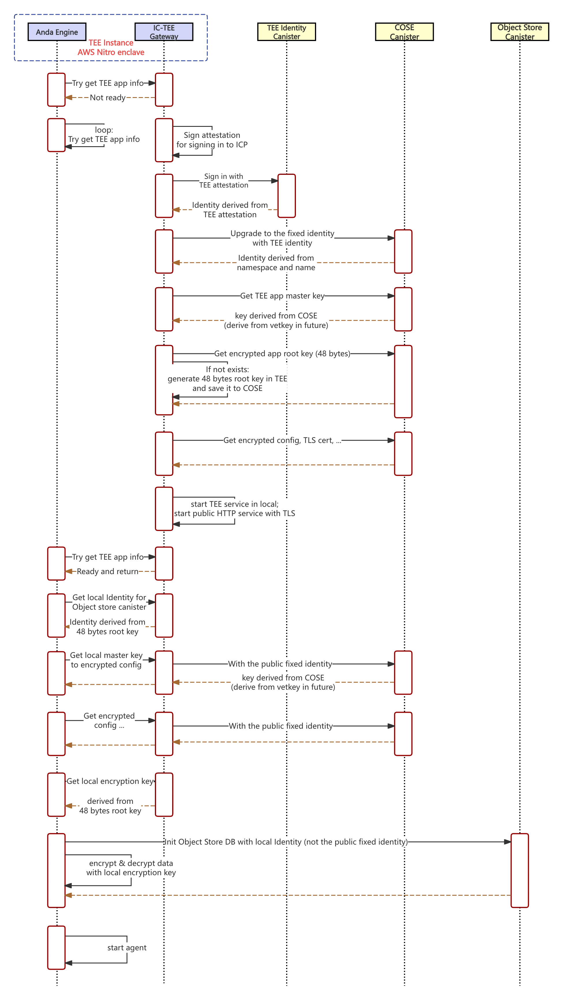

# Anda Architecture

## Overview

`Anda` is an innovative agent development framework designed to build a highly composable, autonomous, and permanently memory-enabled AI agent network. By connecting agents across various industries, Anda aims to create a super AGI system, advancing artificial intelligence to higher levels.

This article introduces the system architecture and core components of the Anda framework.

**Resources**:
- [GitHub: Source code](https://github.com/ldclabs/anda)
- [Extensions: Core agents & tools implementations](https://github.com/ldclabs/anda/tree/main/anda_engine/src/extension)
- [Anda Bot: Full AI agent implementation](https://github.com/ldclabs/anda/tree/main/agents/anda_bot)
- [Anda bot (application on X)](https://x.com/AndaICP)

## System Architecture


To run a complete Anda AI Agent (referred to as Anda), the following three external resources and two internal services are required:

**External Resources**:
1. **LLM Service**
2. **TEE Computing**
3. **ICP Blockchain**

**Internal Services**:
1. **Anda Engine**
2. **IC-TEE Gateway**

### LLM Service

The LLM service provides intelligent computing power to Anda, similar to GPU cloud services, and is replaceable. Currently, the Anda framework supports DeepSeek, Cohere, and OpenAI, with plans to support more LLM services in the future, including open-source LLMs running on TEE GPUs.

- **DeepSeek and Cohere**: Currently offer the best cost-performance ratio, delivering exceptional intelligent computing power at a low cost.
- **DeepSeek on TEE GPU**: For ultimate security and privacy, this is the optimal choice.

### TEE Computing

TEE computing provides Anda with a hardware-level secure isolated computing environment and identity verification.

- **Current Support**: AWS Nitro enclave (via IC-TEE).
- **Future Support**: Intel SGX, NVIDIA TEE GPU, and more.
- **Security**: Only by running in TEE we can ensure that Anda remains untampered, and its computational state (e.g., keys) is secure and cannot be stolen.

### ICP Blockchain

The ICP blockchain provides Anda with decentralized identity verification, root key and data storage, as well as a token economy system and DAO governance mechanism.

- **State Storage**: Since TEE is a stateless computing environment, Anda's operational state needs to be stored on the ICP blockchain to recover in case of program crashes, TEE reboots, or switching between different TEEs.
- **Identity Verification**: As each Anda upgrade changes the TEE Attestation fingerprint, ICP provides a permanent on-chain identity for Anda, enabling trusted interactions with external systems.

### Anda Engine

The Anda Engine is the core scheduling engine of Anda. An Anda AI agent can include multiple agents and tools, which are registered with the Engine and automatically scheduled for execution. The architecture and working principles of the Engine will be detailed in the next section.

### IC-TEE Gateway

[IC-TEE](https://github.com/ldclabs/ic-tee) provides Anda with an internal environment running in TEE, composed of multiple components. The IC-TEE Gateway serves as the bridge between Anda, TEE, and the external world (including the ICP blockchain).

**Startup Process**:
1. Establish a communication channel between the TEE and the host machine.
2. Use TEE Attestation to obtain a temporary identity for Anda from the ICP Identity canister contract.
3. Exchange the temporary identity for a permanent one.
4. Use the permanent identity to read encrypted configuration files, TLS certificates, and Anda's root key from the ICP COSE canister.
   - Encrypted configuration files and TLS certificates must be uploaded to the COSE canister by developers in advance.
   - The root key is generated and encrypted in the TEE during the first startup, then stored in the COSE canister. Subsequent startups will read and decrypt it from the COSE canister, remaining fixed and unchanged.
5. The IC-TEE Gateway starts an HTTPS service using the TLS certificate, enabling secure external communication with Anda.
6. Once everything is ready, the Anda Engine begins communicating with the IC-TEE Gateway, starts up, and provides services externally.
7. After the Anda Engine starts, the IC-TEE Gateway offers the following core services:
   - Derives a series of key-related services from the root key.
   - Proxies ICP canister requests, ensuring Anda uses the same permanent identity when calling canisters.
   - Proxies external HTTPS requests to the Anda Engine.



## Anda Engine Architecture

### Core Crates

| Crate         | Description                                     | Documentation                                      |
| ------------- | ----------------------------------------------- | -------------------------------------------------- |
| `anda_core`   | Defines traits, types, and interfaces           | [docs.rs/anda_core](https://docs.rs/anda_core)     |
| `anda_engine` | Implements runtime, integrations, and utilities | [docs.rs/anda_engine](https://docs.rs/anda_engine) |

### Core Components
#### [Agents](https://docs.rs/anda_core/latest/anda_core/agent/index.html)

- Define AI agents using the `Agent` trait, which specifies capabilities like execution logic, dependencies, and metadata.
- Use `AgentSet` to manage multiple agents and enable dynamic dispatch via `AgentDyn` for runtime flexibility.
- Example use cases: Data extraction, document segmentation, role-playing AI.

```rust
// simplified Agent trait definition
pub trait Agent<C: AgentContext> {
    fn name(&self) -> String;

    fn description(&self) -> String;

    fn definition(&self) -> FunctionDefinition;

    fn tool_dependencies(&self) -> Vec<String>;

    async fn run(
        &self,
        ctx: C,
        prompt: String,
        attachment: Option<Vec<u8>>,
    ) -> Result<AgentOutput, BoxError>;
}
```

#### [Tools](https://docs.rs/anda_core/latest/anda_core/tool/index.html)

- Implement reusable utilities (e.g., APIs, blockchain interactions) via the `Tool` trait. Tools enforce type-safe inputs/outputs and automatically generate JSON function definitions for seamless integration with LLMs.
- Manage tools with `ToolSet` and invoke them dynamically using `ToolDyn`.

```rust
// simplified Tool trait definition
pub trait Tool<BaseContext> {
    const CONTINUE: bool;
    type Args: DeserializeOwned;
    type Output: Serialize;

    fn name(&self) -> String;

    fn description(&self) -> String;

    fn definition(&self) -> FunctionDefinition;

    async fn call(
        &self,
        ctx: C,
        args: Self::Args,
    ) -> Result<Self::Output, BoxError>;
}
```

#### [Context](https://docs.rs/anda_core/latest/anda_core/context/index.html)

- The `BaseContext` provides foundational operations and execution environment for agents/tools, combining:
  - **StateFeatures**: User, caller, time, and cancellation token
  - **KeysFeatures**: Agents/Tools isolated Cryptographic key operations
  - **StoreFeatures**: Agents/Tools isolated persistent storage
  - **CacheFeatures**: Agents/Tools isolated in-memory cache storage with TTL/TTI expiration
  - **CanisterFeatures**: ICP blockchain interactions
  - **HttpFeatures**: HTTPs request capabilities
- The `AgentContext` provides the execution environment for Agents. It combines all `BaseContext` functionality and AI-specific features:
  - **CompletionFeatures**: Provides LLM completion capabilities for agents.
  - **EmbeddingFeatures**: Provides text embedding capabilities for agents.
  - **Runtime Features**: Invoke tools (`tool_call`, `remote_tool_call`, `tool_definitions`) and Run agents (`agent_run`, `remote_agent_run`, `agent_definitions`). Note that an Agent can call other local or remote Agents and Tools through the AgentContext. This can be an explicit call following the Agent's programming logic, or an automatic call based on the suggestions of the large language model!
- [`BaseCtx`](https://docs.rs/anda_engine/latest/anda_engine/context/struct.BaseCtx.html) is a implementation of `BaseContext`.
- [`AgentCtx`](https://docs.rs/anda_engine/latest/anda_engine/context/struct.AgentCtx.html) is a implementation of `AgentContext`.

#### [Models](https://docs.rs/anda_core/latest/anda_core/model/index.html)

Define data structures for AI interactions:
  - `CompletionRequest`: LLM prompts with chat history, documents, and tools.
  - `AgentOutput`: Results from agent execution.
  - `Embedding`: Text-to-vector representations.

#### [Engine](https://docs.rs/anda_engine/latest/anda_engine/engine/index.html)

- The `Engine` orchestrates agent and tool execution, providing a builder pattern for configuration.
- Use `EngineBuilder` to register agents/tools and set up execution parameters.

```rust
let engine = Engine::builder()
   .with_tee_client(my_tee_client)
   .with_model(my_llm_model)
   .register_tool(my_tool)
   .register_agent(my_agent)
   .build("default_agent")?;

let output = engine.agent_run(None, "Hello", None, Some(user), None).await?;
```

### Key Features

- **Modularity**: Separate agents, tools, and context features for clean architecture.
- **Type Safety**: Strongly typed interfaces for agents/tools reduce runtime errors.
- **Async Execution**: Non-blocking I/O for efficient resource use.
- **Context Hierarchy**: Isolated execution contexts with cancellation support.
- **Secure Operations**: Built-in cryptography via TEE (Trusted Execution Environment), verified caller principals, and secure storage.
- **Storage**: In-memory caching, Object storage + vector search capabilities.
- **Extensibility**: Add custom agents/tools or extend `BaseContext`, `AgentContext` with new traits.

## Conclusion

The above outlines the complete composition of an Anda AI agent. While it may appear complex, the Anda framework encapsulates this complexity, allowing developers to focus on their business logic and quickly build secure, efficient, and scalable agents on Anda.

### Future Outlook

Based on the token economy system and DAO governance mechanism, Anda agents can generate revenue while providing services to the external world, creating a positive feedback loop that drives the growth of the agent ecosystem.
